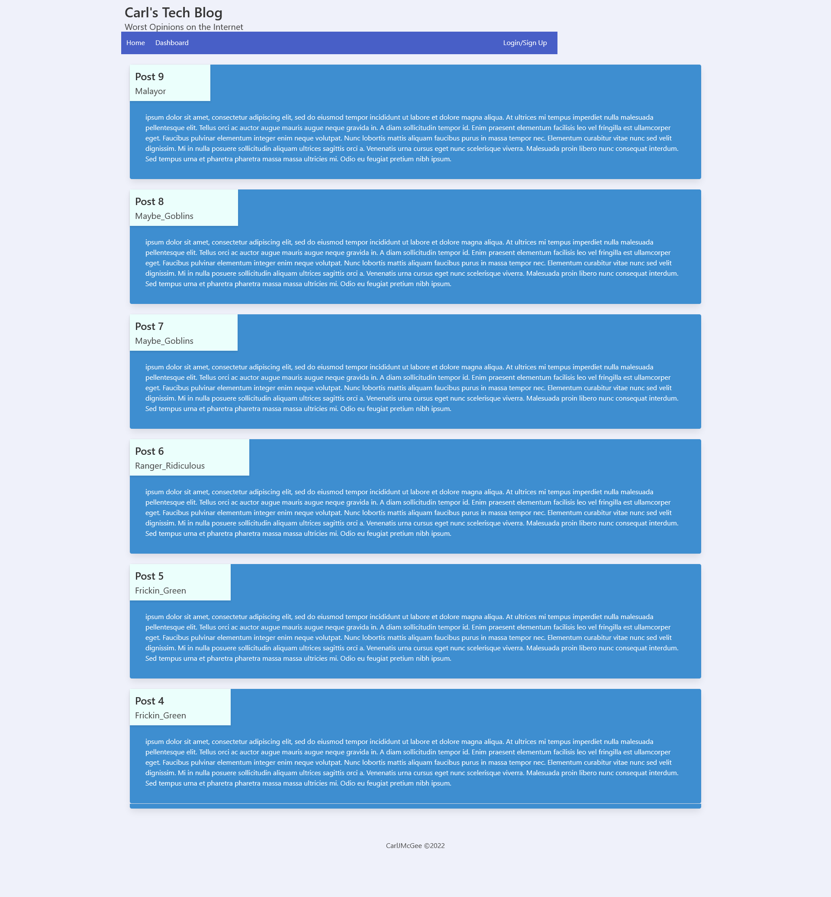

# Carls Tech Blog

## Description

### The best place for the worst opinions.

A quick and simple blogging plateform with everthing you need without the bloat.

- Sign up with just your email, a username, and a password

- Doom scroll through the latest posts from people you don't know

- Comment condesending remarks on any post that bothers you. The comments section is your battleground!

- Post new blogs from your dashboard

- Scroll through your dashboard and cringe at all your old blog posts. Update the titles or content, or just straight up delete your embarrassment away!

- If you fall asleep while estalking, don't worry! The server will log you out after one hour of inactivity

## Table of Contents

- [Installation](#installation)

- [Usage](#usage)

- [Credits](#credits)

- [License](#license)

- [Contributing](#contributing)

- [Tests](#tests)

- [Questions](#questions)

## Installation

n/a

## Usage

As an influencer, I need other people to see every thought I have, and I need to see every thought they have.

## Credits

Created by CarJMcGee

## License

[This project uses MIT License](./mit.txt)

## Contributing

[Click to see the Contributor Covenant guidelines](./code_of_conduct.md)

## Tests

n/a

## Questions?

If you have any issues, submit them to my [Github](https://github.com/CarlJMcGee)

or

If you have any other questions or inquiries, you can contact me at [carl.jack.mcgee@gmail.com](mailto:carl.jack.mcgee@gmail.com)

## [Click Here!](https://carls-tech-blog.herokuapp.com/)

